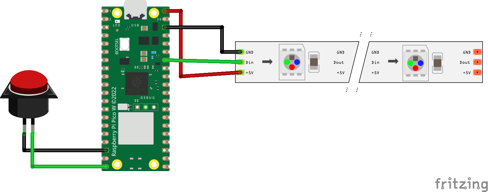

# The Pico Button



## Files in src/* explained

* EXAMPLE: Make the onboard LED blink: `example_board_led.py`
* EXAMPLE: Animate the addressable LED stripe: `example_stripe.py`
* The main programm: `main_button.py`, connects to WIFI and sends a request to an API when the button was pressed. Visual feedback using the LED stripe
* Configuration file example: `example.config.json`

## Install Firmware

* Download the firmware: https://micropython.org/resources/firmware/RPI_PICO_W-20240602-v1.23.0.uf2
* Press Bootsel-button while connecting the Pi to your computer
* The Pico will show up as USB drive
* Copy the downloaded uf2 file to the USB drive
* The drive will disconnect once it is done

## Setup

### VS Code IDE for development

* Install the [MicroPico](https://marketplace.visualstudio.com/items?itemName=paulober.pico-w-go) VS Code extension
* Open Settings -> Extensions -> MicroPico: Check "Auto Connect" or define a "Manual Com Device" address (e.g. /dev/tty.usbmodem12401). This address might change when connected to a differen USB port
* Restart VS Code to ensure the extension is loaded

VS Code should now display "Pico Disconnected/Pico connected" + Run + Upload + Reset on the lower left.

* `Run` will upload and run the current file open in VS Code to the Pico
* `Upload` will just upload the file to the Pico
* `Reset` might be handy in case the Pico does not respond anymore

Don't forget to checkout the available MicroPico commands (Shift + Command + P)

There is also a simplye IDE for beginners called [Thonny](https://thonny.org/)

### Run it on the Pico for development

* Copy the `example.config.json` file to `config.json` and change the WIFI credentials
* With the file open click on the "Upload" Button
* Open `main_button.py` and click on the "Run" Button - This will run the programm on the Pico. Keep in mind to upload imported local modules if changed using the "Upload"

The context menu offers a way to upload all files at once.
:warning: This can cause issues if the folder contains big files, because the space on the Pico is very limited (2MB of on-board flash memory)

### Autorun code

Once you are done coding, make sure the code works as expected!
You may want to run `MicroPico: Delete all files from board` command to have no 
unnecessary files lingering around on the board.

Now follow these steps:

* Upload `config.json`
* Rename `main_button.py` to `main.py` - the `main.py` is special in a way that the Pico will run by default
* Finally upload the `main.py` file

Happy days! ... Unplug the Pico and plug it back in to any suitable power source.

## Somehow bogged? Can't find a way out of `main.py`?

Run `MicroPico: Reset > Soft (listen)` this will 🤞 make vREPL (Terminal) accessible
again. After that any other `MicroPico: *` should just work (e.g. `MicroPico: Delete all files from board`).

List files on the board using the vREPL:

```
import os
os.listdir()
```


In worst case, flash the [flash_nuke.uf2](https://www.raspberrypi.com/documentation/microcontrollers/raspberry-pi-pico.html#resetting-flash-memory) to reset the flash memory and [re-flash the firmware](#install-firmware) again to start over.

## Thoughts:

* Better error handling. No one wants the Pico to throw an Error/Exception, because it needs to be reconnected afterwards.
* Mount the Pico to the case so you can reach the Bootsel (Button on the board) easily with a pen or alike
* How does wifi work? Is there a dedicated AP on the Pi5, so Wifi credentials will never change?

**Useful Links:**

* Pico W datasheet: https://datasheets.raspberrypi.com/picow/connecting-to-the-internet-with-pico-w.pdf
* All available MicroPython boards: https://micropython.org/download/ 